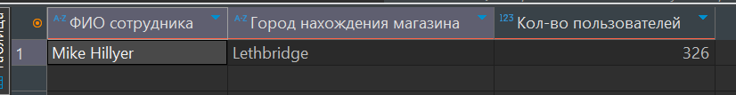
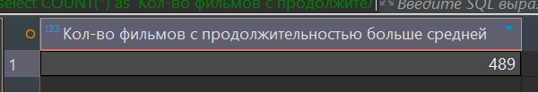
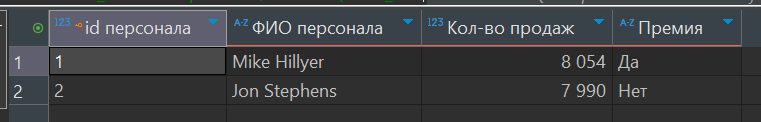
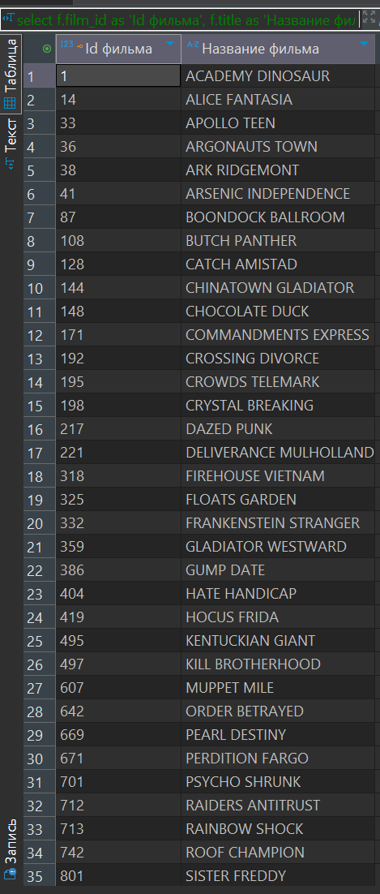

# Домашнее задание к занятию "`SQL. Часть 2`" - `Барышков Михаил`

## Задание 1

Одним запросом получите информацию о магазине, в котором обслуживается более 300 покупателей, и выведите в результат следующую информацию:

- фамилия и имя сотрудника из этого магазина;
- город нахождения магазина;
- количество пользователей, закреплённых в этом магазине.

----

## Решение 1

```sql
SELECT 
    CONCAT(s.first_name, ' ', s.last_name) AS 'ФИО сотрудника',
    city.city AS 'Город нахождения магазина',
    COUNT(c.customer_id) AS 'Кол-во пользователей'
FROM 
    store st
JOIN 
    staff s ON st.manager_staff_id = s.staff_id
JOIN 
    address a ON st.address_id = a.address_id
JOIN 
    city ON a.city_id = city.city_id
JOIN 
    customer c ON st.store_id = c.store_id
GROUP BY 
    st.store_id, CONCAT(s.first_name, ' ', s.last_name), city.city
HAVING 
    COUNT(c.customer_id) > 300;
```



## Задание 2

Получите количество фильмов, продолжительность которых больше средней продолжительности всех фильмов.

----

## Решение 2

```sql
select
	COUNT(*) as 'Кол-во фильмов с продолжительностью больше средней'
from
	film
where
	length > (SELECT AVG(length) FROM film);
```



----

## Задание 3

Получите информацию, за какой месяц была получена наибольшая сумма платежей, и добавьте информацию по количеству аренд за этот месяц.

----

## Решение 3

```sql
select
	DATE_FORMAT(payment_date, '%Y-%m') as 'Платежный месяц',
	SUM(amount) as 'наибольшая сумма платежей',
	COUNT(distinct rental_id) as 'количеству аренд за этот месяц'
from
	payment
group by
	DATE_FORMAT(payment_date, '%Y-%m')
order by
	COUNT(distinct rental_id) desc
limit 1;
```


----

## Дополнительные задания (со звёздочкой*)

Эти задания дополнительные, то есть не обязательные к выполнению, и никак не повлияют на получение вами зачёта по этому домашнему заданию. Вы можете их выполнить, если хотите глубже шире разобраться в материале.

## Задание 4*

Посчитайте количество продаж, выполненных каждым продавцом. Добавьте вычисляемую колонку «Премия». Если количество продаж превышает 8000, то значение в колонке будет «Да», иначе должно быть значение «Нет».

----

## Решение 4

```sql
select
	s.staff_id as 'id персонала',
	CONCAT(s.first_name, ' ', s.last_name) as 'ФИО персонала',
	COUNT(p.payment_id) as 'Кол-во продаж',
	case
		when COUNT(p.payment_id) > 8000 then 'Да'
		else 'Нет'
	end as Премия
from
	staff s
join 
    payment p on
	s.staff_id = p.staff_id
group by
	s.staff_id,
	CONCAT(s.first_name, ' ', s.last_name)
order by
	COUNT(p.payment_id) desc;
```



----

## Задание 5*

Найдите фильмы, которые ни разу не брали в аренду.

----

## Решение 5

```sql
select
	f.film_id as 'Id фильма',
	f.title as 'Название фильма'
from
	film f
left join 
    inventory i on
	f.film_id = i.film_id
left join 
    rental r on
	i.inventory_id = r.inventory_id
where
	r.rental_id is null
order by
	f.title;
```


